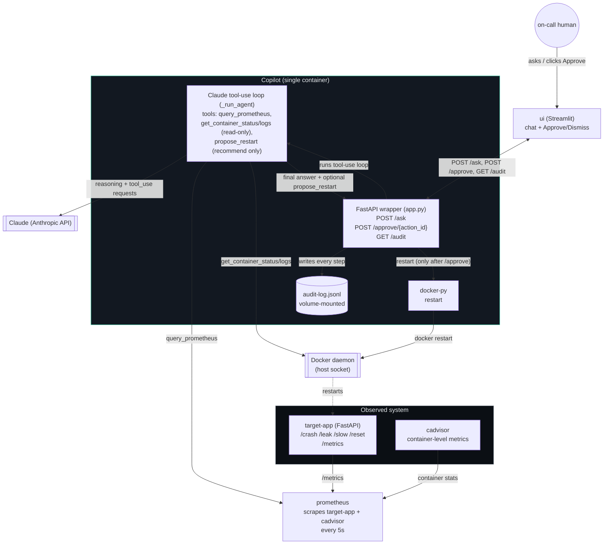
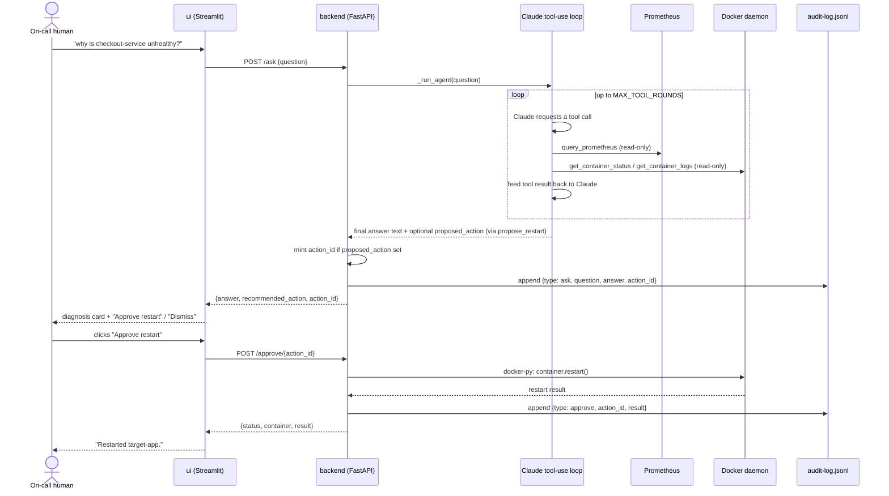
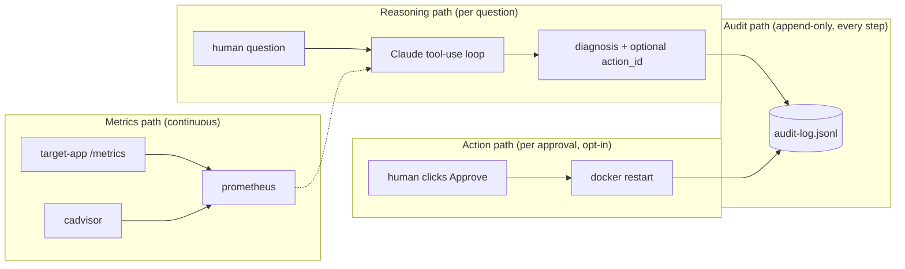
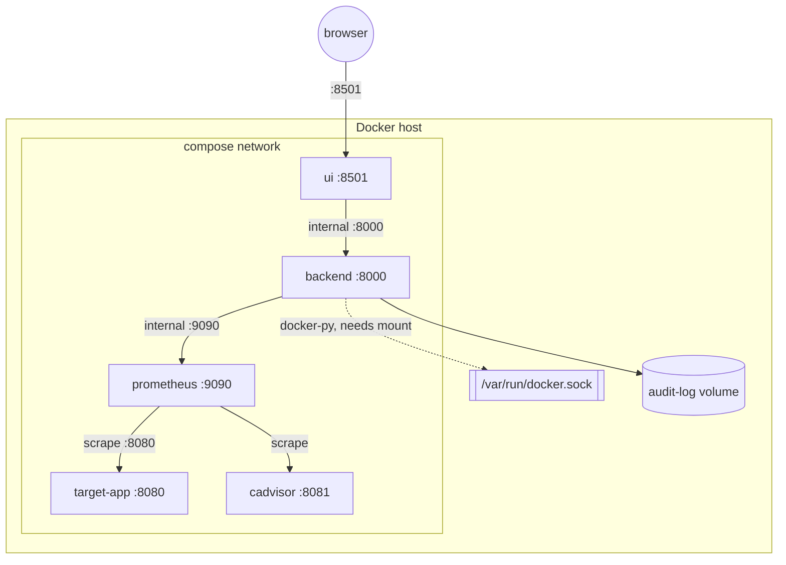

# Architecture — Overwatch-SRE

Deep-dive companion to [README.md](../README.md). Read that first for the pitch and tech-stack
table; this doc is the "how it actually fits together" reference — system diagram, the
propose→approve→execute→audit loop, each component in detail, and what makes this different
from a normal monitoring stack.

- [System overview](#system-overview)
- [What we're actually building](#what-were-actually-building)
- [Components](#components)
- [The core loop: propose → approve → execute → audit](#the-core-loop-propose--approve--execute--audit)
- [Data flow](#data-flow)
- [Deployment topology](#deployment-topology)
- [Design decisions](#design-decisions)
- [Known gaps](#known-gaps)

## System overview



Five moving pieces, one direction of trust: metrics and logs flow *up* into the copilot,
reasoning flows out as a chat answer, and the only thing that flows back *down* into the
observed system is a restart — and only once a human has clicked Approve.

## What we're actually building

The obvious version of this project is "a dashboard with an LLM chatbot bolted on." That's not
the target. Three things distinguish what's actually being built:

1. **One interface, not four.** Instead of a Grafana dashboard, a Prometheus query box, `docker
   logs`, and a runbook wiki, there's one chat window. The copilot correlates metrics + logs +
   container state itself and answers in plain language — "why is checkout-service unhealthy?"
   gets a root-cause answer, not four tabs to cross-reference by hand.
2. **The LLM never acts unilaterally.** The agent is given *read-only* tools only —
   `query_prometheus`, `get_container_status`, `get_container_logs` — plus a `propose_restart`
   tool that *records* a recommendation and never touches the Docker daemon itself. It can look
   at anything, change nothing. The one mutating action in the entire system (`docker restart`)
   is hand-written code in `backend/app.py`'s `/approve` route, deliberately outside any tool the
   model can call, and it only runs when a human calls `POST /approve/{action_id}` — which only
   exists because they clicked a button in the UI. This is "propose → approve → execute," not
   "AI ops autopilot."
3. **Every step is auditable after the fact.** Every question, every diagnosis, every approval,
   and every action's result gets appended to `audit-log.jsonl` — a flat file, not a database,
   deliberately simple enough to `cat` or `tail -f` during a demo (or a real postmortem). Nothing
   the system does is invisible or reconstructible-only-from-memory.

The comparison that matters isn't "this vs. no tooling" — it's "this vs. a human doing the same
correlation work by hand across multiple dashboards, then running `docker restart` themselves."
The copilot compresses that workflow into one conversation and one approval click, without
removing the human from the loop for the one step that has real blast radius.

**On "isn't this just an LLM with tools" —** yes, deliberately. The agent loop itself (call
Claude with a handful of tool schemas, execute whatever it asks for, feed results back until it
gives a final answer) is maybe 40 lines and is *not* the novel part of this project — that
pattern is well-trodden and we're not claiming otherwise. The actual product being built is
everything around that loop: a synthetic incident to investigate (`target-app`), the metrics
pipeline that makes the investigation grounded in real data (Prometheus + cAdvisor), and —
the genuine custom contribution — **the safety boundary that a bare tool-calling agent doesn't
have by default**: a hard split between tools that can only read and a separate, human-gated
code path for the one thing that can write. That split, the audit trail, and the chat UX around
them are what this repo builds; the LLM call is a dependency, like Prometheus or Docker are.

## Components

### 1. `target-app` — the thing that breaks on demand

Plain FastAPI service, no dependency on anything else in the stack. Exists purely to give the
copilot something real to diagnose:

| Endpoint | Effect |
|---|---|
| `GET /crash` | hard-exits the process (`os._exit(1)`) — simulates a crash loop |
| `GET /leak` | appends a 10MB chunk to an in-memory list per call — simulates a memory leak, visible in `app_leak_bytes` |
| `GET /slow` | forces a 3s response and flags "slow mode" for 120s — simulates latency degradation |
| `GET /reset` | clears leak state and slow-mode flag — resets for the next demo run |
| `GET /metrics` | Prometheus exposition format (`prometheus_client`) |

Scraped by `prometheus/prometheus.yml` on `target-app:8080` every 5s, alongside `cadvisor` for
container-level (memory/CPU) metrics.

### 2. `prometheus` + `cadvisor` — off-the-shelf, config only

No custom code — vanilla Prometheus + cAdvisor images wired via `prometheus/prometheus.yml`.
Two scrape jobs: `target-app` (app-level metrics) and `cadvisor` (container-level metrics), the
same data the agent's `query_prometheus` tool reads from to spot "this container's memory is
climbing."

### 3. `backend` — the copilot's brain and its one allowed hand

A single FastAPI container, plain `python:3.11-slim` base (see
[Design decisions](#design-decisions) for why one container and why a hand-written agent). Three
responsibilities, deliberately kept in one file (`backend/app.py`) for a 6-hour build:

- **Diagnosis** — `POST /ask` runs `_run_agent()`: a loop that calls the Anthropic Messages API
  with the question and the tool schemas exposed by the toolset registry (below), executes
  whichever tools Claude requests, feeds the results back, and repeats (capped at
  `MAX_TOOL_ROUNDS`) until Claude returns a final text answer.
- **Action, gated** — if at any point during that loop Claude calls the `propose_restart` tool,
  the handler records `{container, reason}` as `proposed_action` — the tool call itself does
  nothing else. The `/ask` response then carries a `recommended_action` + a freshly minted
  `action_id`, but nothing has executed yet. Only `POST /approve/{action_id}` — called from the
  UI after a human clicks the button — runs `docker-py`'s `container.restart()`.
- **Audit** — every `ask`, `ask_error`, and `approve` event is appended as one JSON line to
  `audit-log.jsonl` (volume-mounted, so it survives container restarts).

#### The toolset framework (`backend/toolsets/`)

This is the part of the backend that's a deliberate, small-scale rebuild of the piece HolmesGPT
used to provide — a pluggable, config-driven set of investigation capabilities — but owned
outright instead of wrapped. It replaces what would otherwise be a single flat list of tool
schemas with a protocol-driven module system:

```mermaid
classDiagram
    class Toolset {
        <<Protocol>>
        +str name
        +bool read_only
        +schemas() list~dict~
        +call(tool_name, tool_input) dict
    }
    class PrometheusToolset {
        query_prometheus
    }
    class DockerToolset {
        get_container_status
        get_container_logs
    }
    class RemediationToolset {
        propose_restart (record only)
    }
    class ToolsetRegistry {
        +schemas
        +call(tool_name, tool_input)
    }
    Toolset <|.. PrometheusToolset
    Toolset <|.. DockerToolset
    Toolset <|.. RemediationToolset
    ToolsetRegistry o-- Toolset : aggregates enabled toolsets
    ToolsetRegistry --> "_run_agent()" : schemas for tools=, dispatch on tool_use
```

- **`Toolset`** (`toolsets/base.py`) is a `typing.Protocol`, not a base class — any object with a
  matching `name`, `read_only`, `schemas()`, and `call()` qualifies. No inheritance required,
  which keeps adding a toolset a pure "write a module" exercise.
- **`PrometheusToolset`**, **`DockerToolset`**, **`RemediationToolset`** each own one narrow slice
  — one HTTP client or one Docker client, a handful of tool schemas, and the logic to execute
  them. `RemediationToolset` is the one exception to "toolsets are read-only": its `call()` never
  touches the Docker daemon, it only returns the proposal for `_run_agent()` to lift into
  `recommended_action`.
- **`ToolsetRegistry`** (`toolsets/registry.py`) aggregates whichever toolsets are enabled into
  one flat `schemas` list (for the Anthropic `tools=` parameter) and one dispatch table keyed by
  tool name, so `_run_agent()` never needs to know which toolset owns which tool.
- **`toolsets.yaml`** enables/disables toolsets by key — the same "config turns capabilities on
  and off" pattern HolmesGPT used, just over our own modules instead of its.
- **To extend:** write a class matching the `Toolset` protocol, register a factory for it in
  `app.py`'s `_build_registry()`, add a line to `toolsets.yaml`. `_run_agent()` and the
  `/ask`/`/approve`/`/audit` routes never need to change — that's the whole point of the
  indirection.

### 4. `ui` — pure HTTP client, owns no logic

Streamlit app. Renders the chat, the vitals strip (a live healthy/degraded/down indicator per
service, driven by the latest `/audit` entry — see [UI-DESIGN.md](UI-DESIGN.md) for the full
visual spec), the inline diagnosis card with Approve/Dismiss buttons, and a collapsible audit
drawer. It holds zero business logic — no client-side decision about what's healthy or what
action to recommend. It only calls `POST /ask`, `POST /approve/{action_id}`, and `GET /audit` and
renders exactly what comes back.

## The core loop: propose → approve → execute → audit

This sequence is the entire point of the project — everything else is plumbing to make this loop
possible and observable.



Note what never happens in this sequence: the agent's `propose_restart` tool never calls
`container.restart()` — it only writes to a Python dict (`_pending_actions`) — and nothing
executes between the diagnosis and the human's click. If the human clicks **Dismiss** instead,
the `action_id` simply expires unused — no code path reaches the Docker daemon.

## Data flow



Four separate paths, one common sink. The metrics path runs continuously regardless of whether
anyone asks a question. The reasoning path runs once per `/ask` call. The action path only ever
runs after an explicit approval. The audit path is the only thing every other path feeds — it's
the reconstructable record of "what did the system know, what did it recommend, what did a human
authorize."

## Deployment topology

Everything runs via `docker compose up --build`. This has been verified end-to-end: build all
five services, hit `target-app`'s `/leak`, ask the copilot why `target-app` is unhealthy, get
back a correct diagnosis (citing `app_leak_bytes` and the `OOM warning` log lines) with a
`propose_restart`-sourced recommendation, call `/approve/{action_id}`, and confirm the container
actually restarts and its leak state clears.



`backend` needs the Docker socket mounted in to restart sibling containers via `docker-py` — this
is the one place the container topology and the "restart a container" feature are coupled. Ports
per README.md: target-app `:8080`, prometheus `:9090`, cadvisor `:8081`, backend `:8000`, ui
`:8501`.

## Design decisions

Carried over from README.md's rationale, restated here for the architectural "why":

- **One backend container, not two.** Splitting "agent reasoning" and "restart execution" into
  separate services would add a network hop and a second deploy unit for no isolation benefit —
  the safety boundary here is the `/approve` gate and the read-only tool set, not process
  isolation. Keeping them in one FastAPI app is simpler to build, reason about, and demo in 6
  hours.
- **A hand-written Claude tool-use loop, not a wrapped agent framework.** Calling the Anthropic
  Messages API directly with a handful of tool schemas is a small, fully-owned, easily-debugged
  loop — no unfamiliar third-party CLI flags or config schema to reverse-engineer under a
  6-hour clock. An external agent framework (HolmesGPT) was evaluated and used earlier in the
  build; see [holmes-gpt-reference.md](holmes-gpt-reference.md) for what it offered and why it
  was dropped in favor of owning the loop directly.
- **A `Toolset` protocol + registry, not one flat tool list.** The loop itself doesn't need this
  — a flat list would run fine — but the point of dropping Holmes was to still get its pluggable,
  config-driven "capabilities" model without its integration risk. `toolsets/base.py`'s
  `Protocol` plus `toolsets.yaml` gets that back cheaply: new capabilities are additive modules,
  not edits to `_run_agent()`.
- **`uv`, not `pip`, everywhere.** Same install semantics across all three Python services,
  meaningfully faster on repeated container rebuilds during a time-boxed build.
- **Claude via the Anthropic API, not a local model.** Docker Model Runner is Apple-Silicon-tuned;
  on Intel hosts it's CPU-only and demo-flaky. `ANTHROPIC_API_KEY` avoids that risk entirely.
- **Docker Compose, not Kubernetes.** minikube/kind startup alone risks 15–30 minutes on an Intel
  Mac. For 5 containers over a 6-hour build, Compose is the entire right-sized answer.
- **JSONL flat file, not a database, for audit.** The audit trail needs to be append-only,
  human-readable, and demoable with `tail -f` — a database adds a migration story and a service
  dependency for a feature that's fundamentally "log every step."

## Known gaps

Tracked in more detail in [CLAUDE.md](../CLAUDE.md#known-gaps--unverified-as-of-last-read):

- No automated tests in any of the four services.
- No CI — the end-to-end verification (leak → diagnose → propose → approve → restart → audit)
  has been run manually once, locally; nothing re-runs it automatically on future changes.
